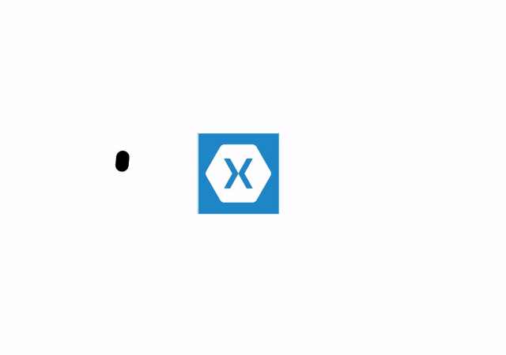

# How-to-create-a-similar-appearance-of-a-circular-progress-bar-using-Xamarin.Forms-SfCircularGauge
This article explains how to create similar appearance of circular progress bar by using Syncfusion Xamarin Form circular gauge control, as shown in below.

 


## Create similar appearance of circular progress bar

It has been achieved by using its RangePointer and Annotation properties. Based on the timer value, we have updated the Value property of RangePointer to have a progress bar look.

[XAML]

```
<gauge:SfCircularGauge HeightRequest="300" WidthRequest="300" HorizontalOptions="Center" VerticalOptions="Center">
            <gauge:SfCircularGauge.Scales>
                <gauge:Scale  StartAngle="185" SweepAngle="270" ShowTicks="False" ShowLabels="False"  ShowRim="False" >
                    <gauge:Scale.Pointers>
                        <gauge:RangePointer RangeStart="0"  RangeCap="Both" x:Name="rangePointer" EnableAnimation="True" Color="Black" StartOffset="0.9" EndOffset ="1" />
                    </gauge:Scale.Pointers>
                </gauge:Scale>
            </gauge:SfCircularGauge.Scales>

            <gauge:SfCircularGauge.Annotations>
                <gauge:GaugeAnnotation Angle="90" >
                    <gauge:GaugeAnnotation.View>
                        <Image BackgroundColor="LightSkyBlue" WidthRequest="100" HeightRequest="100" Source="icon.png" />
                    </gauge:GaugeAnnotation.View>
                </gauge:GaugeAnnotation>
            </gauge:SfCircularGauge.Annotations>
        </gauge:SfCircularGauge>
```
 [C#]
 
 ```
           Device.StartTimer(TimeSpan.FromSeconds(1.5), () =>
            {
                if (rangePointer.Value>=100)
                {
                    rangePointer.Value = 0;
                }
                rangePointer.Value = rangePointer.Value+20;

                 return true;
            });            
```

## See also

[How to customize the range pointer](https://help.syncfusion.com/xamarin/circular-gauge/pointers#range-pointer-customization)

[How to set range cap to range pointer in Xamarin.Forms SfCircularGauge](https://www.syncfusion.com/kb/10580/how-to-set-rangecap-to-rangepointer-in-xamarin-forms-sfcirculargauge?_ga=2.261017163.770060272.1595998348-1273195395.1560836863)

[How to customize the range pointer with rounded corner](https://www.syncfusion.com/kb/8291/rounded-corner-support-for-rangepointer?_ga=2.266240585.770060272.1595998348-1273195395.1560836863) 

[Pointers in Xamarin Circular Gauge (SfCircularGauge)](https://www.syncfusion.com/kb/8291/rounded-corner-support-for-rangepointer?_ga=2.266240585.770060272.1595998348-1273195395.1560836863)

